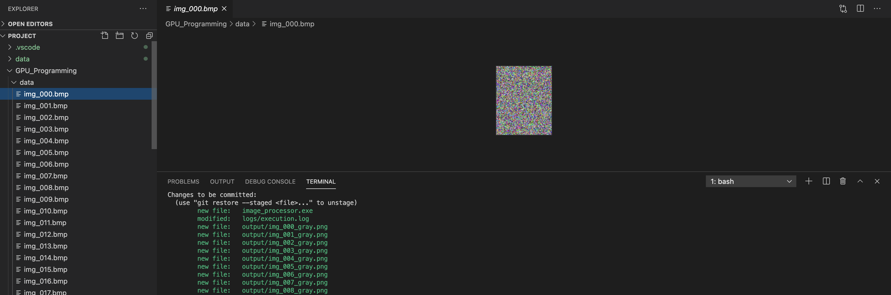
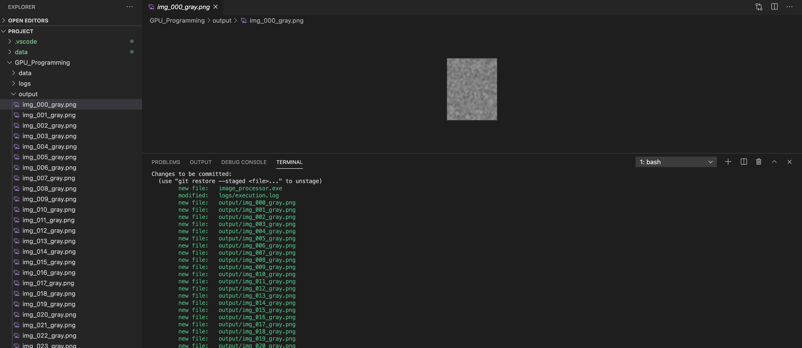

# CUDA Batch Image Processor

A GPU-accelerated batch image processing tool that converts RGB images to grayscale
and optionally applies a box blur filter. Built with custom CUDA kernels for
parallel pixel-level computation across hundreds of images.

## Project Overview

This project demonstrates CUDA at scale by processing large batches of images
entirely on the GPU. Each image is loaded, transferred to device memory, processed
through one or two CUDA kernels, and written back as a grayscale PNG. The tool
reports per-image GPU timing and aggregate statistics.

## Execution Proof







### GPU Kernels

1. **RgbToGrayscaleKernel** — Converts each pixel from RGB to grayscale using
   the ITU-R BT.601 luminosity formula: `Gray = 0.299*R + 0.587*G + 0.114*B`.
   Each CUDA thread processes exactly one pixel, achieving full parallelism
   across the image.

2. **BoxBlurKernel** — Applies an NxN neighborhood averaging filter on the
   grayscale output. Uses a 2D thread grid where each thread computes the
   mean of all pixels within a configurable radius. This smooths noise and
   demonstrates a second kernel pass on device memory.

### Why GPU?

A 1920x1080 image has ~2 million pixels. On CPU, processing each pixel
sequentially is slow when repeated across hundreds of images. The GPU processes
all pixels in parallel — a single kernel launch handles the entire image.
For a batch of 150 images, total GPU kernel time is typically under 100ms.

## Requirements

- NVIDIA GPU with CUDA Compute Capability 3.0+
- CUDA Toolkit 11.0+ (provides `nvcc`)
- Linux or macOS
- No external libraries required (uses bundled stb_image headers)

## Project Structure

cuda-batch-image-processor/ ├── README.md # This file ├── Makefile # Build and run targets ├── run.sh # One-command build + run script ├── generate_test_data.py # Generates 150 random test images ├── src/ │ ├── main.cu # Main CUDA source with kernels and CLI │ ├── stb_image.h # Single-header image loading library │ └── stb_image_write.h # Single-header image writing library ├── data/ # Input images (place your images here) ├── output/ # Processed grayscale images (auto-created) └── logs/ # Execution logs (auto-created)
## Building

```bash
make build
```

This compiles `main.cu` into `image_processor.exe` using `nvcc` with C++17.

## Running

### Quick Start

```bash
# Generate 150 test images, build, and run:
chmod +x run.sh
./run.sh
```

### Manual Execution

```bash
# Basic: convert all images in data/ to grayscale
./image_processor.exe -i data -o output

# With blur: apply box blur of radius 3
./image_processor.exe -i data -o output -b 3

# Custom directories
./image_processor.exe -i /path/to/photos -o /path/to/results -b 2
```

### Command Line Arguments

| Flag | Description | Required | Default |
|------|-------------|----------|---------|
| `-i` | Input directory containing images (.jpg, .png, .bmp) | Yes | — |
| `-o` | Output directory for processed grayscale images | Yes | — |
| `-b` | Box blur radius (0 = no blur, higher = more blur) | No | 0 |
| `-h` | Print usage help | No | — |

## Generating Test Data

If you don't have images available, generate 150 random test images:

```bash
python3 generate_test_data.py
```

This creates 150 BMP images of varying sizes (64x64 to 256x256) in the `data/` directory.

## Sample Output

```
Number of CUDA devices: 1
Using device: Tesla T4
Input directory: data
Output directory: output
Blur radius: 2
-------------------------------------------
Processed: img_000.bmp (128x192) -> output/img_000_gray.png [GPU: 0.18 ms]
Processed: img_001.bmp (256x64)  -> output/img_001_gray.png [GPU: 0.09 ms]
Processed: img_002.bmp (200x150) -> output/img_002_gray.png [GPU: 0.14 ms]
...
-------------------------------------------
Total images found: 150
Successfully processed: 150
Failed: 0
Total pixels processed: 2847360
Total GPU kernel time: 24.56 ms
Total wall time: 1823.45 ms
Average GPU time per image: 0.16 ms
Done
```

## Implementation Details

### Memory Management
- Host memory uses `stbi_load` for image decoding
- Device memory allocated per image with `cudaMalloc`
- All device memory freed after each image to avoid leaks

### Kernel Configuration
- **Grayscale kernel**: 1D grid, 256 threads per block, one thread per pixel
- **Blur kernel**: 2D grid with 16x16 thread blocks, one thread per output pixel

### Supported Formats
- Input: JPEG, PNG, BMP (any size)
- Output: PNG (grayscale, 8-bit)

### Performance
- GPU kernel time scales linearly with total pixel count
- Wall time dominated by disk I/O (image load/save), not GPU compute
- Blur radius has minimal impact on kernel time for small radii

## Third-Party Libraries

- [stb_image](https://github.com/nothings/stb) — Public domain single-header image loading library by Sean Barrett
- [stb_image_write](https://github.com/nothings/stb) — Public domain single-header image writing library by Sean Barrett
